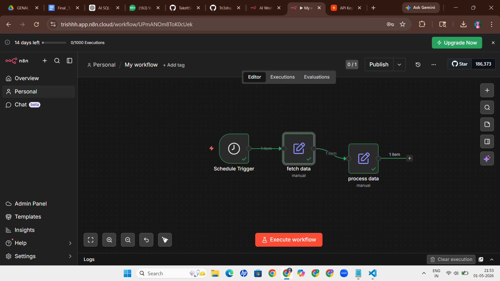
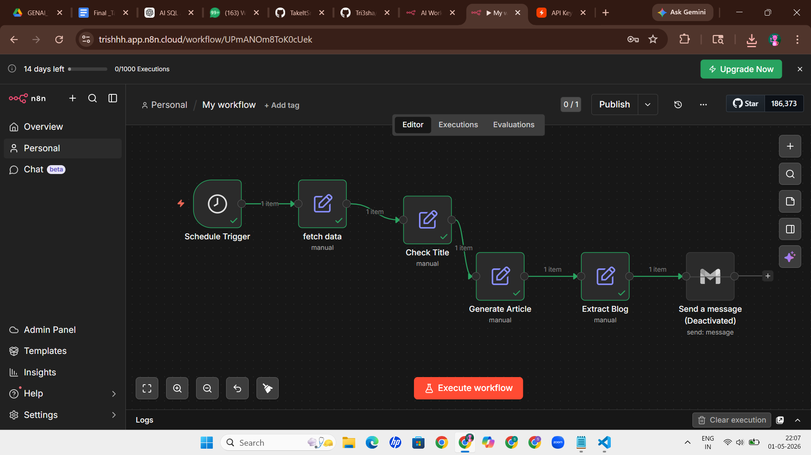

# 🚀 AI News Auto Blogger (n8n Workflow)

## 📌 Objective
This project demonstrates an automated workflow that fetches AI-related data, processes it, and generates blog content.

## 🧠 Workflow Structure
Schedule Trigger → Fetch Data → Check Title → Generate Article → Extract Blog → Gmail

## ⚙️ Steps

### 1. Schedule Trigger
Runs automatically at a scheduled time.

### 2. Fetch Data
Retrieves AI-related information.

### 3. Check Title
Processes and filters relevant content.

### 4. Generate Article
Creates structured article output.

### 5. Extract Blog
Converts article into blog format.

### 6. Gmail
Prepares the blog to be sent via email.

## 📸 Screenshots

